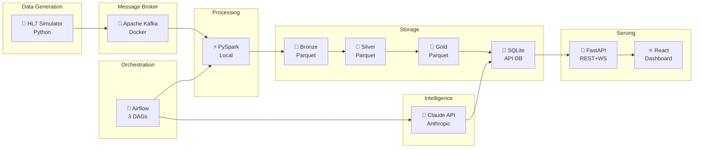
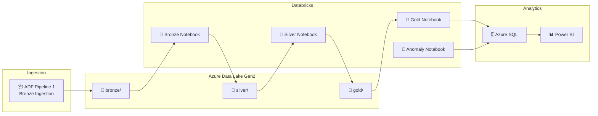
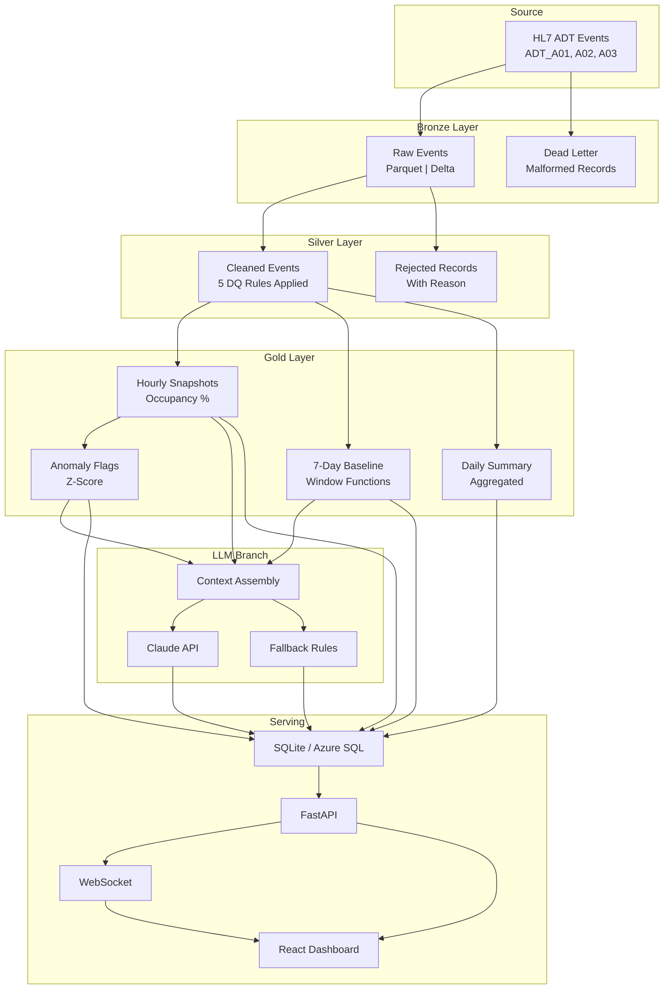

# Architecture Diagrams

## 1. Local Development Architecture

```mermaid
graph LR
    subgraph "Data Generation"
        SIM["🏥 HL7 Simulator<br/>Python"]
    end

    subgraph "Message Broker"
        KAFKA["📨 Apache Kafka<br/>Docker"]
    end

    subgraph "Processing"
        SPARK["⚡ PySpark<br/>Local"]
    end

    subgraph "Storage"
        BRONZE["🥉 Bronze<br/>Parquet"]
        SILVER["🥈 Silver<br/>Parquet"]
        GOLD["🥇 Gold<br/>Parquet"]
        SQLITE["💾 SQLite<br/>API DB"]
    end

    subgraph "Orchestration"
        AF["🔄 Airflow<br/>3 DAGs"]
    end

    subgraph "Intelligence"
        LLM["🤖 Claude API<br/>Anthropic"]
    end

    subgraph "Serving"
        API["🚀 FastAPI<br/>REST+WS"]
        REACT["⚛️ React<br/>Dashboard"]
    end

    SIM --> KAFKA
    KAFKA --> SPARK
    SPARK --> BRONZE --> SILVER --> GOLD
    GOLD --> SQLITE
    AF --> SPARK
    AF --> LLM
    SQLITE --> API
    API --> REACT
    LLM --> SQLITE
```

## 2. Cloud Architecture (Azure)

```mermaid
graph LR
    subgraph "Ingestion"
        ADF1["📦 ADF Pipeline 1<br/>Bronze Ingestion"]
    end

    subgraph "Azure Data Lake Gen2"
        B["🥉 bronze/"]
        S["🥈 silver/"]
        G["🥇 gold/"]
    end

    subgraph "Databricks"
        DB1["📓 Bronze Notebook"]
        DB2["📓 Silver Notebook"]
        DB3["📓 Gold Notebook"]
        DB4["📓 Anomaly Notebook"]
    end

    subgraph "Analytics"
        ASQL["🗄️ Azure SQL"]
        PBI["📊 Power BI"]
    end

    ADF1 --> B
    B --> DB1 --> S
    S --> DB2 --> G
    G --> DB3
    DB3 --> ASQL
    DB4 --> ASQL
    ASQL --> PBI
```

## 3. Data Lineage

```mermaid
graph TD
    subgraph "Source"
        E["HL7 ADT Events<br/>ADT_A01, A02, A03"]
    end

    subgraph "Bronze Layer"
        B["Raw Events<br/>Parquet | Delta"]
        DL["Dead Letter<br/>Malformed Records"]
    end

    subgraph "Silver Layer"
        S["Cleaned Events<br/>5 DQ Rules Applied"]
        R["Rejected Records<br/>With Reason"]
    end

    subgraph "Gold Layer"
        G1["Hourly Snapshots<br/>Occupancy %"]
        G2["7-Day Baseline<br/>Window Functions"]
        G3["Daily Summary<br/>Aggregated"]
        G4["Anomaly Flags<br/>Z-Score"]
    end

    subgraph "LLM Branch"
        CTX["Context Assembly"]
        LLM["Claude API"]
        FB["Fallback Rules"]
    end

    subgraph "Serving"
        DB["SQLite / Azure SQL"]
        API["FastAPI"]
        WS["WebSocket"]
        DASH["React Dashboard"]
    end

    E --> B
    E --> DL
    B --> S
    B --> R
    S --> G1
    S --> G2
    S --> G3
    G1 --> G4
    G1 --> CTX
    G2 --> CTX
    G4 --> CTX
    CTX --> LLM
    CTX --> FB
    G1 --> DB
    G2 --> DB
    G3 --> DB
    G4 --> DB
    LLM --> DB
    FB --> DB
    DB --> API
    API --> WS
    API --> DASH
    WS --> DASH
```
